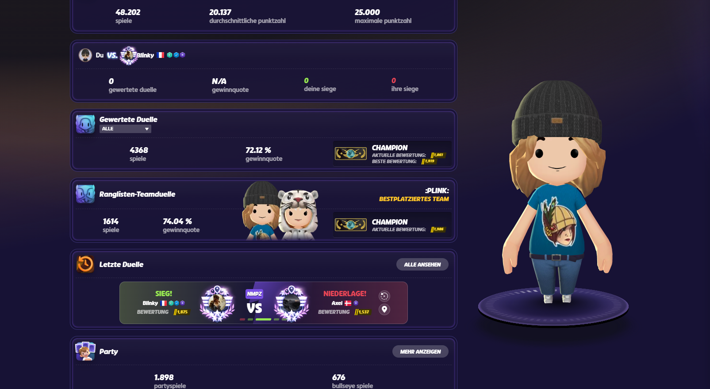
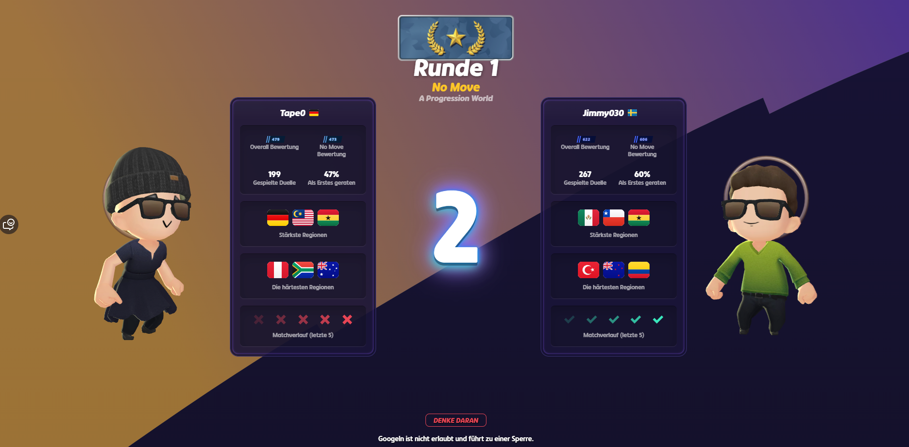
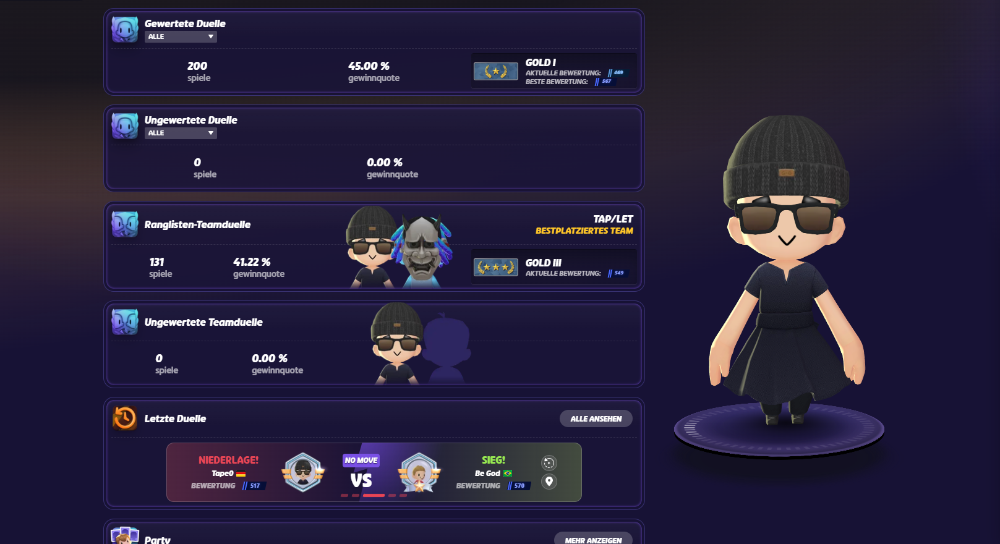

# GeoGuessr CS2 Ranks

Browser extension (Chrome + Firefox) that replaces GeoGuessr division badges with classic Counter-Strike 2 competitive skill group icons, and styles ratings as CS2 Premier badges. Runs only on `https://www.geoguessr.com/`.

**Open source** under [GPL-3.0](LICENSE). See [PRIVACY.md](PRIVACY.md) for the privacy policy.

You may use, modify, and redistribute this project freely, as long as derivative works remain open source under the same license.

<p align="center">
  
  &nbsp;&nbsp;
  <a href="https://addons.mozilla.org/en-US/firefox/addon/geoguessr-cs2-ranks/">
    
  </a>
</p>

<p align="center">
  <sub>Chrome Web Store listing is not available yet. Firefox is live on <a href="https://addons.mozilla.org/en-US/firefox/addon/geoguessr-cs2-ranks/">addons.mozilla.org</a>.</sub>
</p>

Icons are **not** shipped in the package — they are downloaded on demand from [SteamTracking/GameTracking-CS2](https://github.com/SteamTracking/GameTracking-CS2) status icons.

## Screenshots









## Manual install

### Chrome / Chromium / Edge

1. Open `chrome://extensions` (or `edge://extensions`)
2. Enable **Developer mode**
3. Click **Load unpacked**
4. Select the [`src`](src) folder

### Firefox

1. Open `about:debugging#/runtime/this-firefox`
2. Click **Load Temporary Add-on…**
3. Select [`src/manifest.json`](src/manifest.json) (or a packaged `.zip` from CI)
4. Note: temporary add-ons are removed when Firefox restarts — prefer the [Firefox Add-ons listing](https://addons.mozilla.org/en-US/firefox/addon/geoguessr-cs2-ranks/) for a permanent install

5. Open [geoguessr.com](https://www.geoguessr.com/) and check a ranked division badge

### Packaged zip (CI)

GitHub Actions builds `geoguessr-cs2-ranks.zip` on every push/PR (artifact) and attaches it to releases when you push a `v*` tag:

```bash
git tag v1.4.0
git push origin v1.4.0
```

## Rank mapping

| GeoGuessr | CS2 skill group |
| --- | --- |
| Bronze (any) | Silver I (`skillgroup1`) |
| *(no rank / empty)* | Unranked (`skillgroup_none`) — any `*DivisionImageEmpty` (solo/duel/team/…) |
| Silver IV | Silver IV (`skillgroup4`) |
| Silver III | Silver III (`skillgroup3`) |
| Silver II | Silver II (`skillgroup2`) |
| Silver I | Silver I (`skillgroup1`) |
| Gold IV | Gold Nova Master (`skillgroup10`) |
| Gold III | Gold Nova III (`skillgroup9`) |
| Gold II | Gold Nova II (`skillgroup8`) |
| Gold I | Gold Nova I (`skillgroup7`) |
| Master IV | Distinguished Master Guardian (`skillgroup14`) |
| Master III | Master Guardian Elite (`skillgroup13`) |
| Master II | Master Guardian II (`skillgroup12`) |
| Master I | Master Guardian I (`skillgroup11`) |
| Champion | The Global Elite (`skillgroup18`) |

Rank keys are matched mode-agnostically (solo, duel, team, ranked prefixes are stripped), so the same icons apply everywhere on geoguessr.com.

### Collected medals → CS service medals

| GeoGuessr | Remote asset |
| --- | --- |
| Bronze | `service_medal_2018_lvl1_large` (grey) |
| Silver | `service_medal_2018_lvl2_large` (light blue) |
| Gold | `service_medal_2018_lvl3_large` (blue) |
| Platinum | `service_medal_2018_lvl5_large` (pink) |

### Premier rating colors

CS2 Premier colors use 5,000-point bands. GeoGuessr ratings are scaled by **×20** (`scaled = rating × 20`) so they map onto those bands.

| Tier | Color | CS2 rating | GeoGuessr rating |
| --- | --- | --- | --- |
| 0 | Grey | 0 – 4,999 | 0 – 249 |
| 1 | Light blue | 5,000 – 9,999 | 250 – 499 |
| 2 | Blue | 10,000 – 14,999 | 500 – 749 |
| 3 | Purple | 15,000 – 19,999 | 750 – 999 |
| 4 | Pink | 20,000 – 24,999 | 1,000 – 1,249 |
| 5 | Red | 25,000 – 29,999 | 1,250 – 1,499 |
| 6 | Gold | 30,000+ | 1,500+ |

## Project layout

```
src/                 # extension package root (load this folder / zip these files)
  manifest.json
  …
badges/              # store install buttons for the README
screenshots/         # README images
.github/workflows/   # CI packaging
LICENSE              # GPL-3.0
PRIVACY.md
README.md
```

## License

Copyright (C) 2026 haouarihk

This project is licensed under the [GNU General Public License v3.0](LICENSE).

You can run, study, share, and modify it. If you distribute a modified version, you must also release it under GPL-3.0 (keep it open source).
